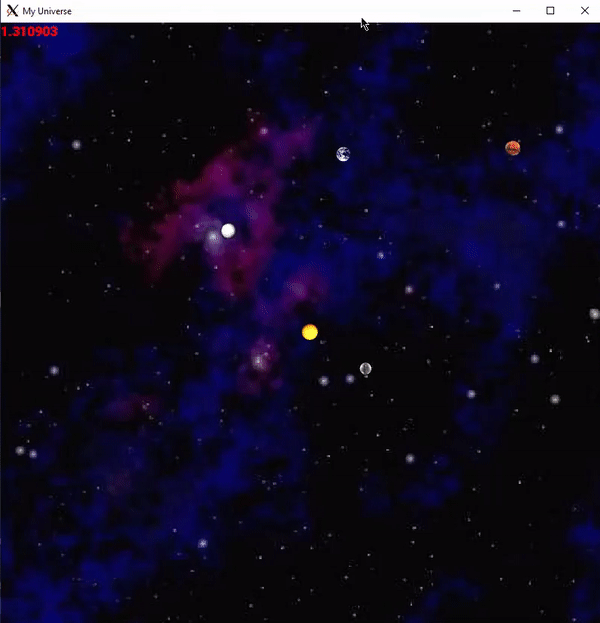

# N-body-Simulation
A celestial universe, done with the help of the SFML graphics library, VcXsrv, and C++.

Each individual planet is drawn to the screen with SFML and VcXsrv, which the positions of
each planet updated constantly to achieve the result of the planets orbiting.

## Tools
- SFML
- VcXsrv
- C++

